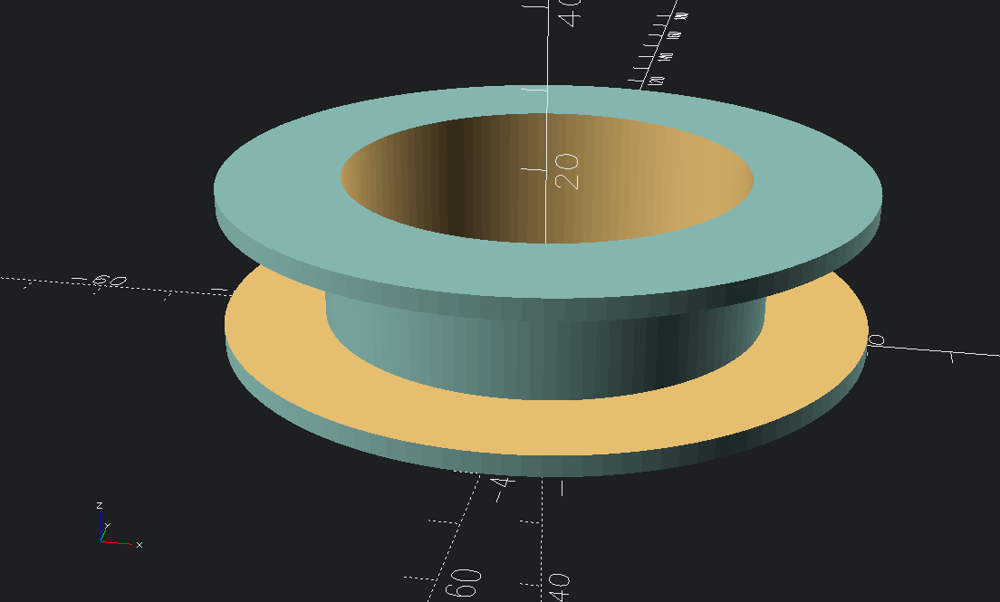
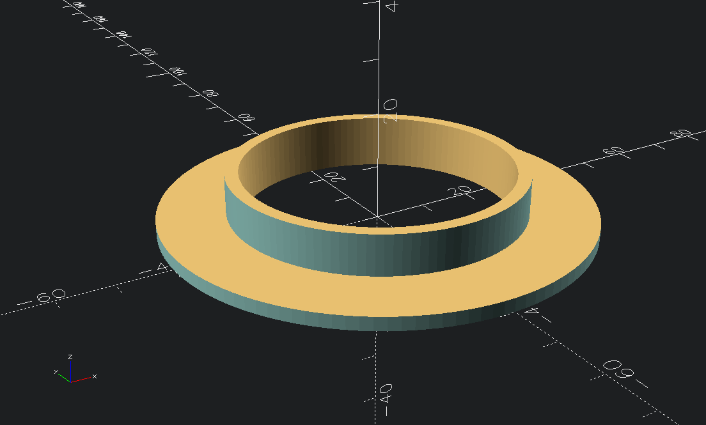

# cable sort

# Cable Spool

very simple cable spool, mostly to learn openscad

## notations
> [!NOTE]
> seperated the model in two half's, because faster print time and no supports are needed

> [!TIP]
> for the full model just glue the two half's together

## Screenshots
<!-- screenshots created with openscad -->

## Authors

- [@s-weigl-github](https://github.com/s-weigl-github)

## TODO

Might finish off items out of order since I usually work on multiple at a time.

- [ ] put a radius on all the corners
- [ ] make it parametric
