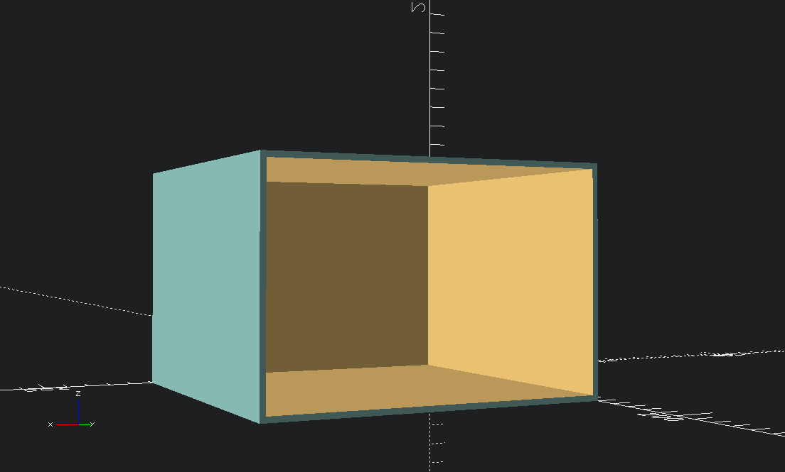
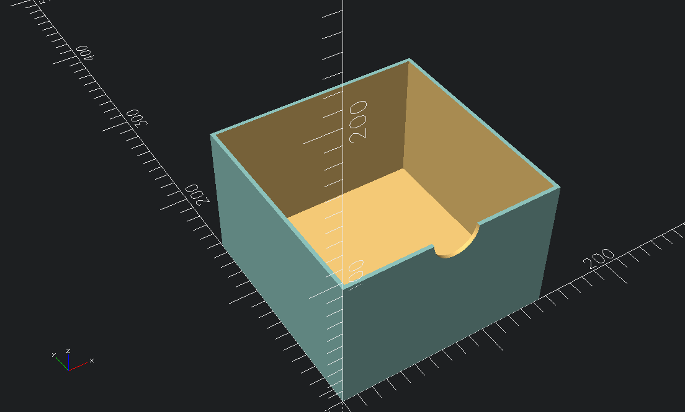
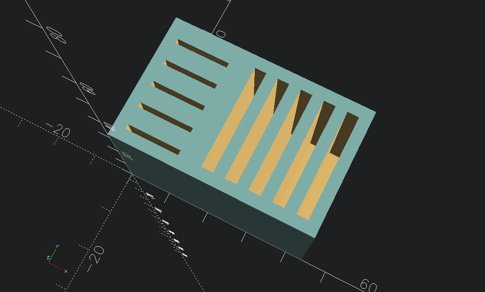
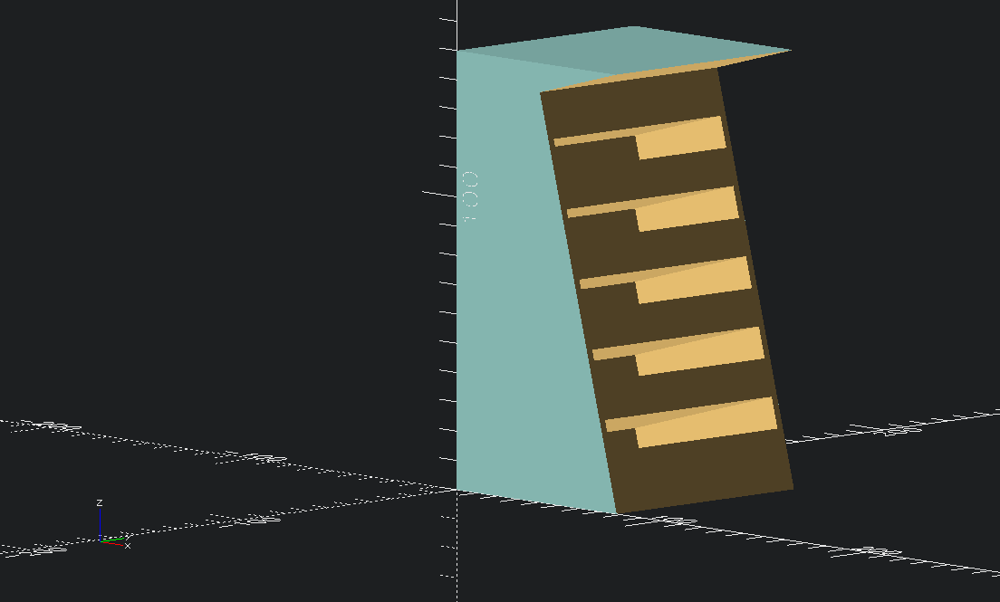
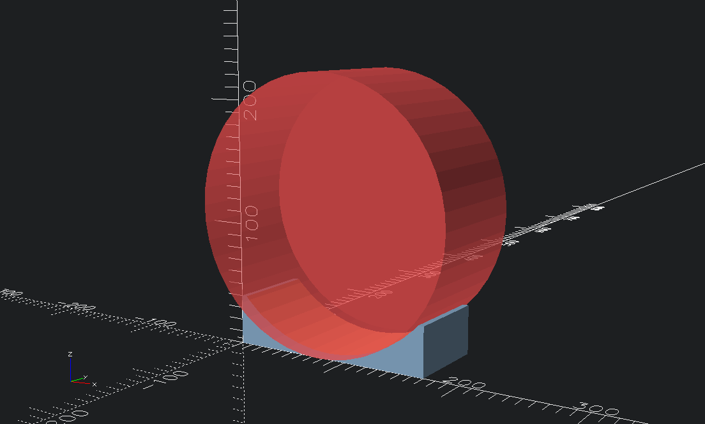

# desk organizer

# desk organizer

desk organizer to caombat the clutter on my desk

## notations
> [!NOTE]
> ---

> [!TIP]
> ---

## Screenshots
<!-- screenshots created with openscad -->

## Authors

- [@s-weigl-github](https://github.com/s-weigl-github)

## TODO

Might finish off items out of order since I usually work on multiple at a time.

- [ ] put a radius on all the corners
- [ ] make it parametric
- [ ] \[Optional] add something, so the cable doesn't unspool itself