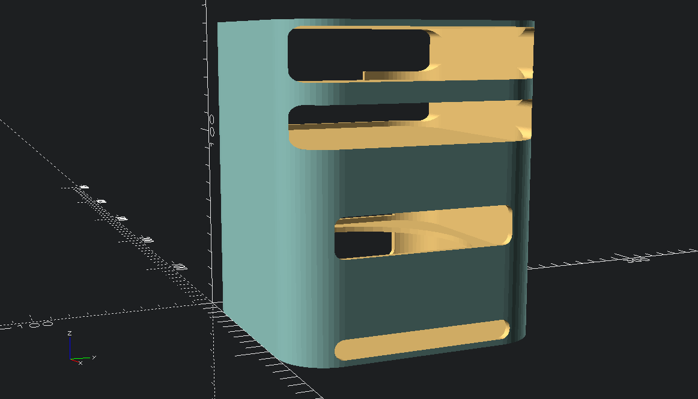
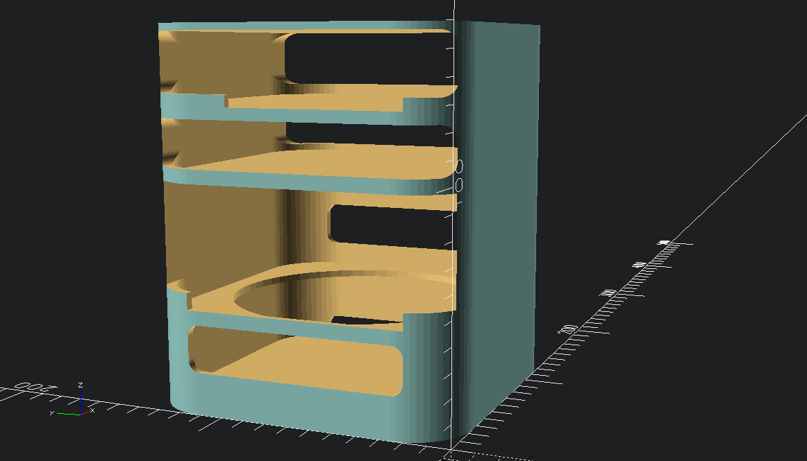
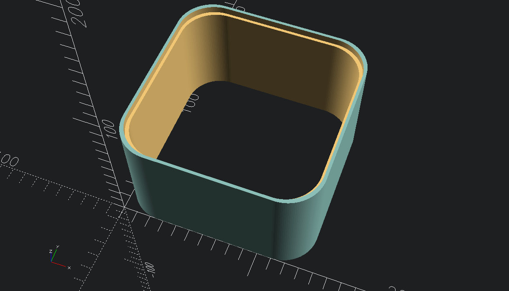
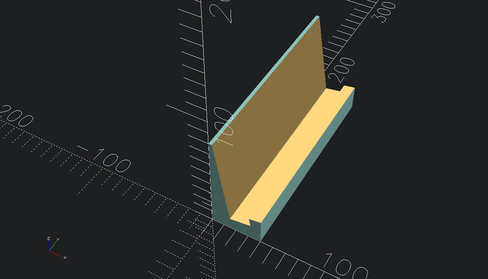

# other stuff

# other stuff

very simple stand for my new mac mini m4

## notations
> [!NOTE]
> untested as of 06.11.2025

> [!TIP]
> ---

## Screenshots
<!-- screenshots created with openscad -->

## Authors

- [@s-weigl-github](https://github.com/s-weigl-github)
> roundedcube.scad script from
- [@groovenectar](https://github.com/groovenectar/)

## TODO

Might finish off items out of order since I usually work on multiple at a time.

- [ ] test the fit
- [ ] make it parametric
- [ ] \[Optional] add some kind of filter to the bottom
- [ ] \[Optional] separate cold and hot side from each other