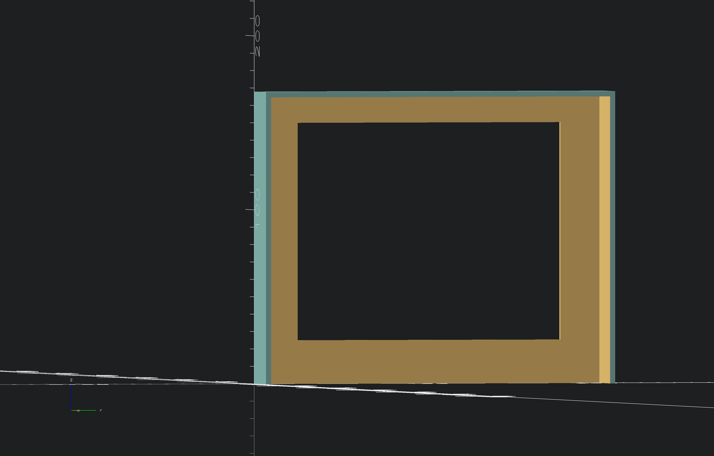

# Nas Dust Cover

Dust cover for my Synology DS916+

## notations
> [!NOTE]
> untested as of 23.08.2026

## Screenshots
<!-- screenshots created with openscad -->

## Authors

- [@s-weigl-github](https://github.com/s-weigl-github)
> roundedcube.scad script from
- [@groovenectar](https://github.com/groovenectar/)

## TODO

- [ ] 1
- [ ] test the fit
  - [ ] 2.1
- [ ] \[Optional] 3
- [ ] \[MAYBE] make it parametric
- [x] \[DONE] put 3mf into git ignore