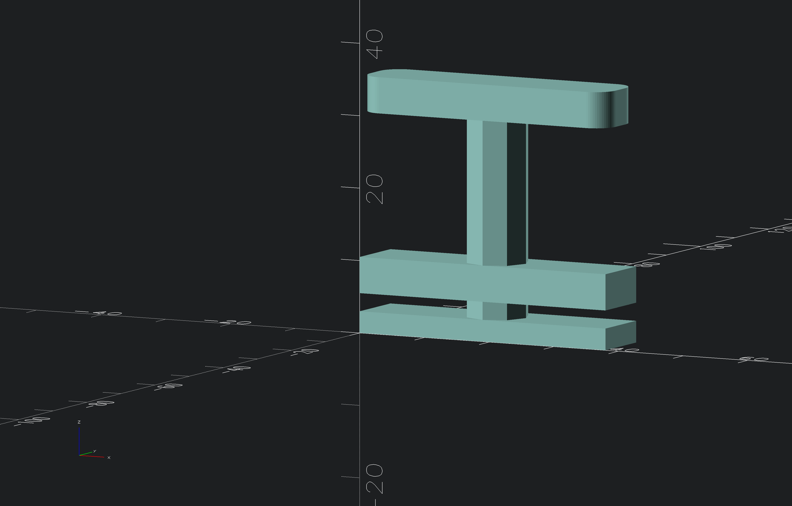

# piggy bank grip

removable grip for piggy bank

## notations
> [!NOTE]
> untested as of 26.09.2026

## Screenshots
<!-- screenshots created with openscad -->

## Authors

- [@s-weigl-github](https://github.com/s-weigl-github)
> roundedcube.scad script from
- [@groovenectar](https://github.com/groovenectar/)

