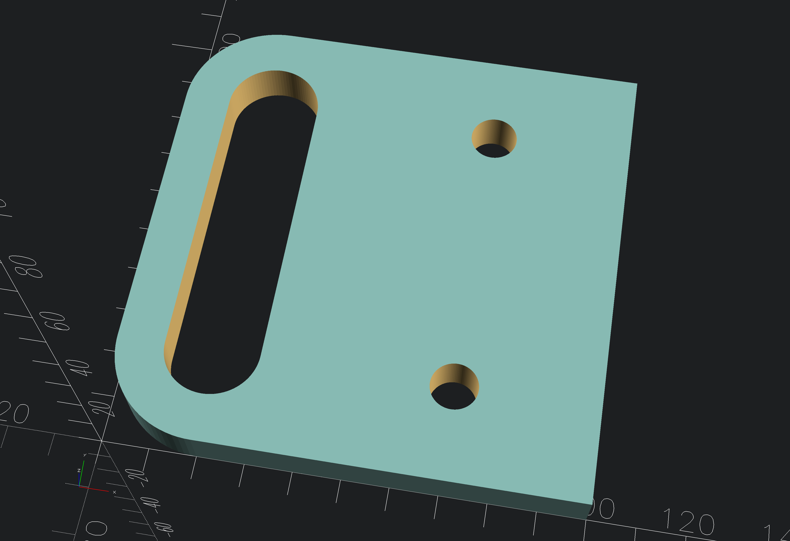
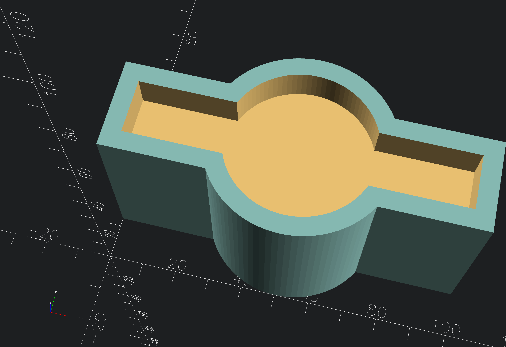
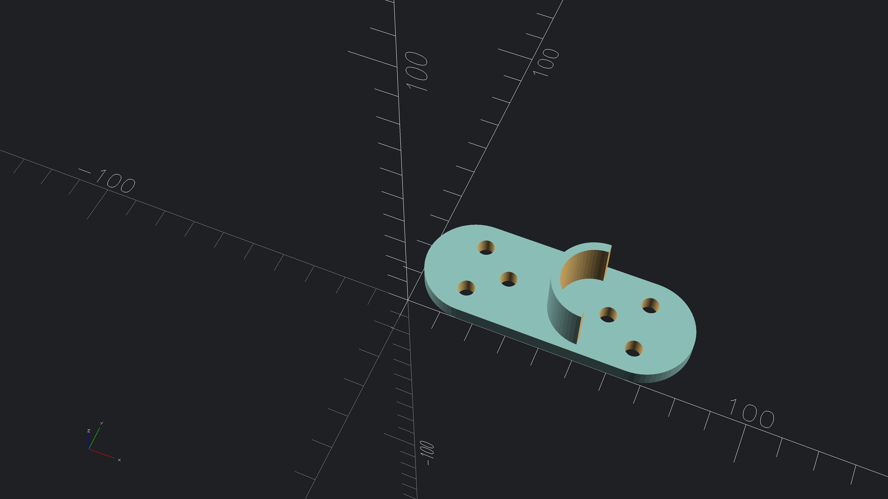
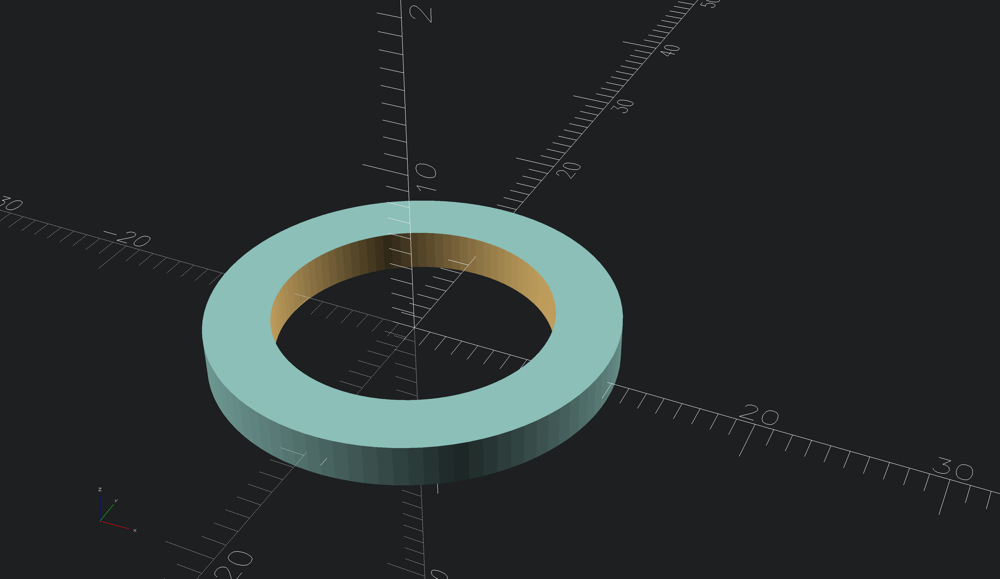
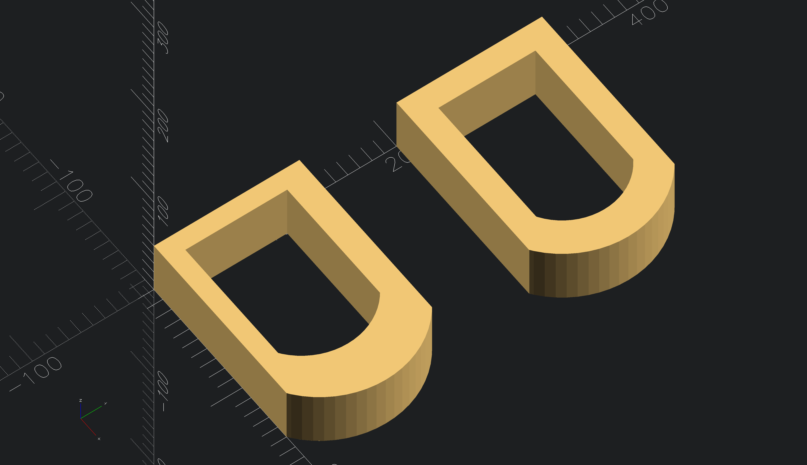

# OpenSCAD test obj

## Screenshots
<!-- screenshots created with openscad -->

*obj with hull test*

*test with union and difference

*test with diferent obj and hull

*simple obj

*simple obj test with module and scale

## Authors

- [@s-weigl-github](https://github.com/s-weigl-github)
> roundedcube.scad script from
- [@groovenectar](https://github.com/groovenectar/)

