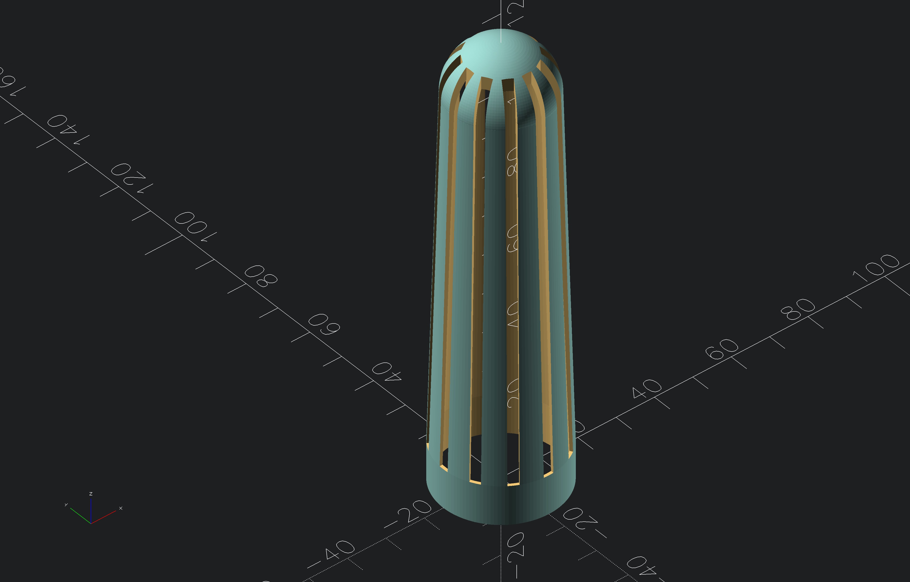

# dry stick

to be filled with silica gel desiccant

## Screenshots
<!-- screenshots created with openscad -->

* dry stick -- version 01

## Authors

- [@s-weigl-github](https://github.com/s-weigl-github)
