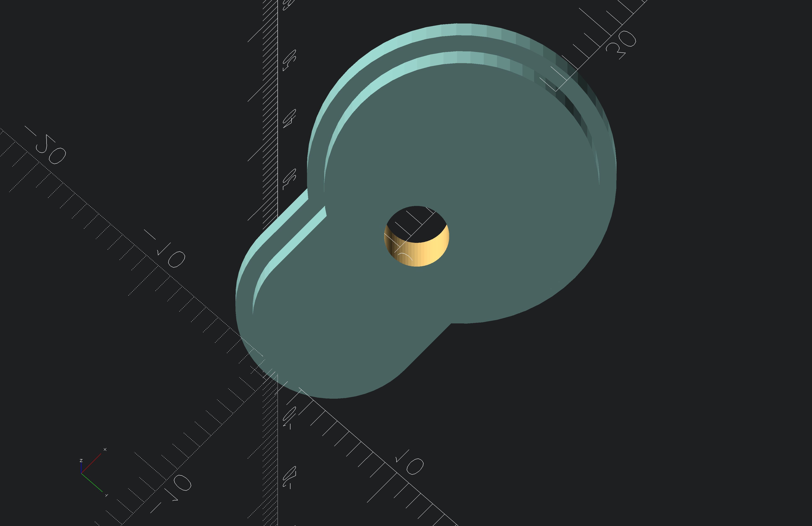

# screw adapter for 19" under desk rack

hole adapter to screw with only 1 screw

## notations
> [!NOTE]
> seperated the model in two half's, because faster print time and no supports are needed

## Screenshots
<!-- screenshots created with openscad -->

## Authors

- [@s-weigl-github](https://github.com/s-weigl-github)

## TODO

Might finish off items out of order since I usually work on multiple at a time.

- [ ] put a radius on all the corners
- [ ] make it parametric
- [ ] \[Optional] add something, so the cable doesn't unspool itself