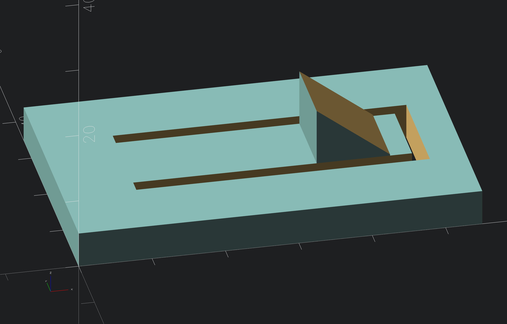
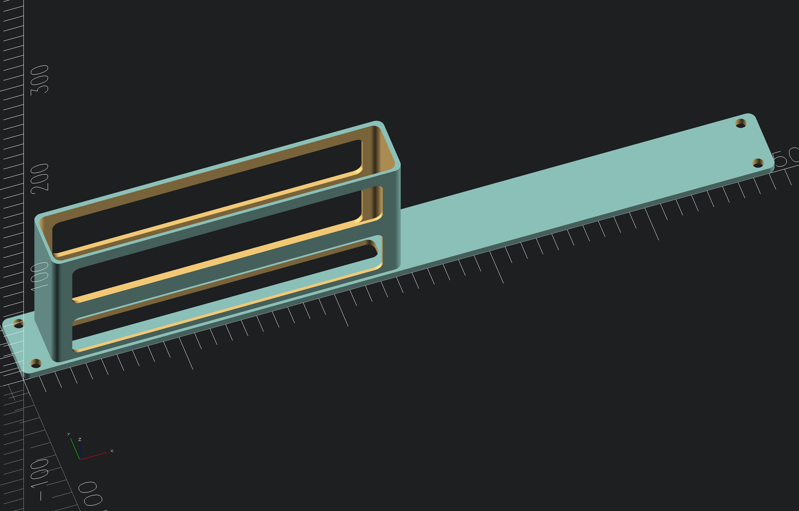

# unify rack mount

rack mount for unify flex

## Notation
>[!NOTE]
> with clip module in openscad to hold the components

## Screenshots
<!-- screenshots created with openscad -->

## Authors

- [@s-weigl-github](https://github.com/s-weigl-github)
> roundedcube.scad script from
- [@groovenectar](https://github.com/groovenectar/)

## TODO

- [ ] 1
- [ ] 2
  - [ ] 2.1
- [ ] \[Optional] 3
- [ ] \[bla] 4
- [x] \[DONE] 5